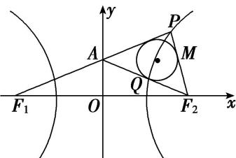

> [!faq]- 教师版例题解析
>
> > [!success]- **【答案】** C
>
> > [!note]- **【分析】**
> > 本题未单列分析。
>
> > [!note]- **【解析】**
> > 答案 C 解析 如图，设 $\triangle PAF_{2}$ 的内切圆与 $PF_{2}$ 相切于点 $M$ 。依题意知， $|AF_{1}| = |AF_{2}|$ ，根据双曲线的定义，以及 $P$ 是双曲线 $E$ 右支上一点，得 $2a = |PF_{1}| - |PF_{2}|$ ，根据三角形内切圆的性质，得 $|PF_{1}| = |AF_{1}| + |PA| = |AF_{1}| + (|PM| + |AQ|)$ ， $|PF_{2}| = |PM| + |MF_{2}| = |PM| + |QF_{2}| = |PM| + (|AF_{2}| - |AQ|)$ 。所以 $2a = 2|AO| = 2\sqrt{3}$ ，即 $a = \sqrt{3}$ 。因为 $|F_{1}F_{2}| = 6$ ，所以 $c = 3$ ，所以双曲线 $E$ 的离心率是 $e = \frac{c}{a} = \frac{3}{\sqrt{3}} = \sqrt{3}$ ，故选 C.
> > 
