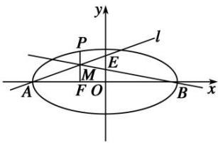

> [!faq]- 教师版对点训练解析
>
> > [!success]- **【答案】** A
>
> > [!note]- **【分析】**
> > 本题未单列分析。
>
> > [!note]- **【解析】**
> > 答案 A 解析 解法一：设 $E(0, m)$ ，则直线 AE 的方程为 $-\frac{x}{a} + \frac{y}{m} = 1$ ，由题意可知 $M(-c, m - \frac{mc}{a})$ ， $(0, \frac{m}{2})$ 和 $B(a, 0)$ 三点共线，则 $\frac{m - \frac{mc}{a} - \frac{m}{2}}{-c} = \frac{\frac{m}{2}}{-a}$ ，化简得 a = 3c，则 C 的离心率 $e = \frac{c}{a} = \frac{1}{3}$ .
> > 解法二：如图所示，由题意得 $A(-a, 0)$ ， $B(a, 0)$ ， $F(-c, 0)$ .
> > 
> > 由 $PF \perp x$ 轴得 $P(-c, \frac{b^2}{a})$ . 设 $E(0, m)$ , 又 $PF \parallel OE$ , 得 $\frac{|MF|}{|OE|} = \frac{|AF|}{|AO|}$ , 则 $|MF| = \frac{m(a - c)}{a}$ , ①. 又由 $OE \parallel MF$ , 得 $\frac{\frac{1}{2}|OE|}{|MF|} = \frac{|BO|}{|BF|}$ , 则 $|MF| = \frac{m(a + c)}{2a}$ , ②. 由①②得 $a - c = \frac{1}{2}(a + c)$ , 即 $a = 3c$ , 所以 $e = \frac{c}{a} = \frac{1}{3}$ ,
> >
> > 故选 **A**.
