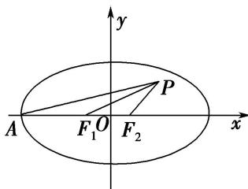

> [!faq]- 《专题02 建立f(a，b，c)＝0模型-圆锥曲线》例题解析
>
> > [!success]- **【答案】** D
>
> > [!note]- **【解析】**
> > 答案 D 解析 由题意可得椭圆的焦点在 x 轴上，如图所示，设 $\left|F_{1}F_{2}\right|=2c,\quad\because\triangle PF_{1}F_{2}$ 为等腰三角形，且 $\angle F_{1}F_{2}P=120^{\circ},\quad\therefore\left|PF_{2}\right|=\left|F_{1}F_{2}\right|=2c.\because\left|OF_{2}\right|=c,\quad\therefore$ 点 P 坐标为 $(c+2c\cos60^{\circ},2c\sin60^{\circ})$ ，即点 $P(2c,\sqrt{3}c)$ . ∵ 点 P 在过点 A，且斜率为 $\frac{\sqrt{3}}{6}$ 的直线上，∴ $\frac{\sqrt{3}c}{2c+a}=\frac{\sqrt{3}}{6}$ ，解得 $\frac{c}{a}=\frac{1}{4},\quad\therefore e=\frac{1}{4}$ ，故选 D.
> >
> > 
