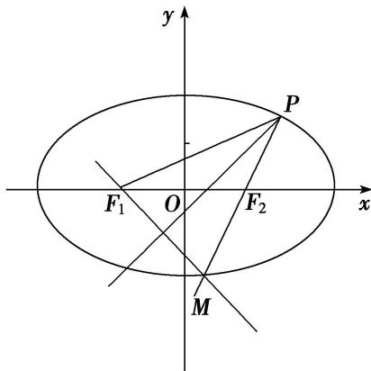

> [!faq]- 《专题02 建立f(a，b，c)＝0模型-圆锥曲线》例题解析
>
> > [!success]- **【答案】** 详见解析
>
> > [!note]- **【解析】**
> > 答案 $\frac{\sqrt{3}}{3}$ 解析 如图，∵ $F_{1}$ 关于 $\angle F_{1}PF_{2}$ 平分线的对称点在椭圆C上，∴P， $F_{2}$ ，M三点共线，
> >
> > 
> >
> > 设 $|PF_{1}|=m$ ，则 $|PM|=m,\quad|MF_{1}|=m$ ．又 $|PF_{1}|+|PM|+|MF_{1}|=4a=3m$ ． $\because|PF_{1}|=\frac{4}{3}a,\quad|PF_{2}|=\frac{2}{3}a$ ．由余弦定理可得 $|PF_{1}|^{2}+|PF_{2}|^{2}-2|PF_{1}||PF_{2}|\cos\frac{\pi}{3}=|F_{1}F_{2}|^{2},\quad\therefore a^{2}=3c^{2},\quad e=\frac{c}{a}=\frac{\sqrt{3}}{3}.$
