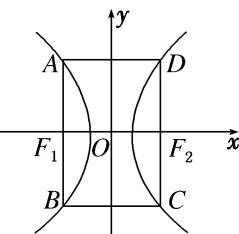

<!-- question-source:start -->
24. 已知双曲线 $E: \frac{x^2}{a^2} - \frac{y^2}{b^2} = 1 (a > 0, b > 0)$ , 若矩形 $ABCD$ 的四个顶点在 $E$ 上, $AB$ , $CD$ 的中点为 $E$ 的两个焦点, 且 $2|AB| = 3|BC|$ , 则 $E$ 的离心率是 \_\_\_\_.

<!-- question-source:end -->

![[高中/总复习/专题/圆锥曲线/专题02 建立f(a，b，c)＝0模型-圆锥曲线/专题02_建立f_a_b_c__0模型_圆锥曲线/对点训练/answers/Q00041514A1.md]]
