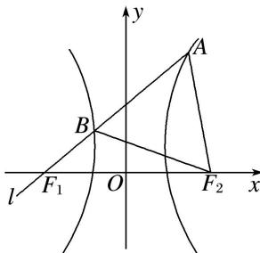

> [!faq]- 《专题02 建立f(a，b，c)＝0模型(教师版)》例题解析
>
> > [!success]- **【答案】** A
>
> > [!note]- **【解析】**
> > 答案 A 解析 因为 $\triangle ABF_{2}$ 为等边三角形，所以不妨设 $|AB| = |BF_{2}| = |AF_{2}| = m$ 因为 A 为双曲线右支上一点，所以 $\left|F_{1}A\right|-\left|F_{2}A\right|=\left|F_{1}A\right|-\left|AB\right|=\left|F_{1}B\right|=2a$ ，因为 B 为双曲线左支上一点，所以 $\left|BF_{2}\right|-\left|BF_{1}\right|=2a,\quad\left|BF_{2}\right|=4a$ ，由 $\angle ABF_{2}=60^{\circ}$ ，得 $\angle F_{1}BF_{2}=120^{\circ}$ ，在 $\triangle F_{1}BF_{2}$ 中，由余弦定理得 $4c^{2}=4a^{2}+16a^{2}-2\cdot2a\cdot4a\cdot\cos120^{\circ}$ ，得 $c^{2}=7a^{2}$ ，则 $e^{2}=7$ ，又 e>1，所以 $e=\sqrt{7}$ 。故选 A.
> >
> > 
