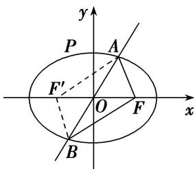

> [!faq]- 《专题03 离心率范围(最值)模型-圆锥曲线》例题解析
>
> > [!success]- **【答案】** C
>
> > [!note]- **【解析】**
> > 答案 C 解析 如图所示，设 $F'$ 为椭圆的左焦点，连接 $AF'$ ， $BF'$ ，则四边形 $AFBF'$ 是平行四边形，
> >
> > 
> >
> > $\therefore 6 = |AF| + |BF| = |AF'| + |AF| = 2a, \therefore a = 3.$ 取 $P(0, b)$ ， $\because$ 点 $P$ 到直线 $l: 4x + 3y = 0$ 的距离不小于 $\frac{6}{5}$ ， $\therefore \frac{|3b|}{\sqrt{16 + 9}} \geq \frac{6}{5}$ ，解得 $b \geq 2.$ $\therefore c \leq \sqrt{9 - 4} = \sqrt{5}, \therefore 0 < \frac{c}{a} \leq \frac{\sqrt{5}}{3}.$ $\therefore$ 椭圆 $E$ 的离心率范围是 $\left[0, \frac{\sqrt{5}}{3}\right]$ .
> >
> > 故选 **C**.
