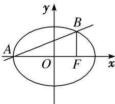

<!-- question-source:start -->
47. 过椭圆 $C: \frac{x^2}{a^2} + \frac{y^2}{b^2} = 1 (a > b > 0)$ 的左顶点 $A$ 且斜率为 $k$ 的直线交椭圆 $C$ 于另一点 $B$ , 且点 $B$ 在 $x$ 轴上的射影恰好为右焦点 $F$ . 若 $\frac{1}{3} < k < \frac{1}{2}$ , 则椭圆 $C$ 的离心率的取值范围是( )

A. $\left[\frac{1}{4},\frac{3}{4}\right]$ B. $\left[\frac{2}{3},1\right]$ C. $\left[\frac{1}{2},\frac{2}{3}\right]$ D. $\left[0,\frac{1}{2}\right]$
<!-- question-source:end -->

![[高中/总复习/专题/圆锥曲线/专题03 离心率范围(最值)模型-圆锥曲线/专题03_离心率范围_最值_模型/对点训练/answers/Q00041540A1.md]]
