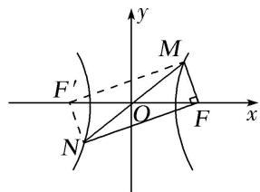

> [!faq]- 《专题03 离心率范围(最值)模型-圆锥曲线》例题解析
>
> > [!success]- **【答案】** B
>
> > [!note]- **【分析】**
> > 本题未单列分析。
>
> > [!note]- **【解析】**
> > 答案 D 解析 如图，设左焦点为 $F'$ ，连接 $MF'$ ， $NF'$ ，令 $|MF|=r_{1}$ ， $|MF'|=r_{2}$ ，则 $|NF|=|MF'|=r_{2}$ ，由双曲线定义可知 $r_{2}-r_{1}=2a①$ ，∵点 M 与点 N 关于原点对称，且 $MF\perp NF$ ，∴ $|OM|=|ON|=|OF|=c$ ，∴ $r_{1}^{2}+r_{2}^{2}=4c^{2②}$ ，
> >
> > 
> >
> > 由①②得 $r_{1}r_{2}=2(c^{2}-a^{2})$ ，又知 $S_{\triangle MNF}=2S_{\triangle MOF}$ ，∴ $\frac{1}{2}r_{1}r_{2}=2\cdot\frac{1}{2}c^{2}\cdot\sin2\beta$ ，∴ $c^{2}-a^{2}=c^{2}\cdot\sin2\beta$ ，∴ $e^{2}=\frac{1}{1-\sin2\beta}$ ，又∵ $\beta\in\left[\frac{\pi}{12},\frac{\pi}{6}\right]$ ，∴ $\sin2\beta\in\left[\frac{1}{2},\frac{\sqrt{3}}{2}\right]$ ，∴ $e^{2}=\frac{1}{1-\sin2\beta}\in[2,(\sqrt{3}+1)^{2}]$ 。又 e>1，∴ $e\in[\sqrt{2},\sqrt{3}+1]$ 。
