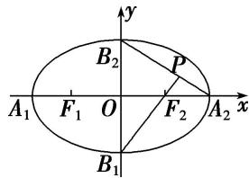

<!-- question-source:start -->
53. 如图, 椭圆的中心在坐标原点 $O$ , 顶点分别是 $A_{1}, A_{2}, B_{1}, B_{2}$ , 焦点分别为 $F_{1}, F_{2}$ , 延长 $B_{1}F_{2}$ 与 $A_{2}B_{2}$ 交于 $P$ 点, 若 $\angle B_{1}PA_{2}$ 为钝角, 则此椭圆的离心率的取值范围为 \_\_\_\_.

<!-- question-source:end -->

![[高中/总复习/专题/圆锥曲线/专题03 离心率范围(最值)模型-圆锥曲线/专题03_离心率范围_最值_模型/对点训练/题目/answers/Q00032399A1.md]]
