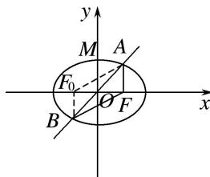

> [!faq]- 教师版对点训练解析
>
> > [!success]- **【答案】** A
>
> > [!note]- **【分析】**
> > 本题未单列分析。
>
> > [!note]- **【解析】**
> > 答案 A 解析 设左焦点为 $F_{0}$ ，连接 $F_{0}A$ ， $F_{0}B$ ，则四边形 $AFBF_{0}$ 为平行四边形.
> > 
> > $\because |AF| + |BF| = 4, \therefore |AF| + |AF_0| = 4, \therefore a = 2.$ 设 $M(0, b)$ ，则 $M$ 到直线 $l$ 的距离 $d = \frac{4b}{5} \geq \frac{4}{5}, \therefore 1 \leq b < 2.$ 离心率 $e = \frac{c}{a} = \sqrt{\frac{c^2}{a^2}} = \sqrt{\frac{a^2 - b^2}{a^2}} = \sqrt{\frac{4 - b^2}{4}} \in \left[0, \frac{\sqrt{3}}{2}\right]$ ，
> >
> > 故选 **A**.
