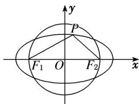

> [!faq]- 教师版对点训练解析
>
> > [!success]- **【答案】** A
>
> > [!note]- **【分析】**
> > 本题未单列分析。
>
> > [!note]- **【解析】**
> > 答案 A 解析 法一：设 $P(x_0, y_0)$ ，由题意知 $|x_0| < a$ ，因为 $\angle F_1PF_2$ 为钝角，所以 $PF_1 \longrightarrow \cdot PF_2 \longrightarrow < 0$ 有解，即 $(-c - x_0, -y_0) \cdot (c - x_0, -y_0) < 0$ ，化简得 $c^2 > x_0^2 + y_0^2$ ，即 $c^2 > (x_0^2 + y_0^2)_{\min}$ ，又 $y_0^2 = b^2 - \frac{b^2}{a^2} x_0^2$ ， $0 \leq x_0^2 < a^2$ ，故 $x_0^2 + y_0^2 = b^2 + \frac{c^2}{a^2} x_0^2 \in [b^2, a^2)$ ，所以 $(x_0^2 + y_0^2)_{\min} = b^2$ ，故 $c^2 > b^2$ ，又 $b^2 = a^2 - c^2$ ，所以 $e^2 = \frac{c^2}{a^2} > \frac{1}{2}$ ，解得 $e > \frac{\sqrt{2}}{2}$ ，又 $0 < e < 1$ ，故椭圆 $C$ 的离心率的取值范围是 $\left[\frac{\sqrt{2}}{2}, 1\right]$ .
> > 
> > 法二：椭圆上存在点 P 使 $\angle F_{1}PF_{2}$ 为钝角 $\Leftrightarrow$ 以原点 O 为圆心，以 c 为半径的圆与椭圆有四个不同的交点 $\Leftrightarrow b<c$ 。如图，由 b<c ，得 $a^{2}-c^{2}<c^{2}$ ，即 $a^{2}<2c^{2}$ ，解得 $e=\frac{c}{a}>\frac{\sqrt{2}}{2}$ ，又 0<e<1 ，故椭圆 C 的离心率的取值范围是 $\left(\frac{\sqrt{2}}{2},1\right)$ .
