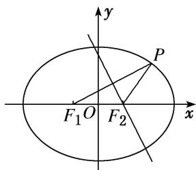

> [!faq]- 教师版对点训练解析
>
> > [!success]- **【答案】** C
>
> > [!note]- **【分析】**
> > 本题未单列分析。
>
> > [!note]- **【解析】**
> > 答案 C 解析 如图所示，∵线段 $PF_{1}$ 的中垂线经过 $F_{2}$ ，∴ $|PF_{2}| = |F_{1}F_{2}| = 2c$ ，即椭圆上存在一点 P，使得 $|PF_{2}| = 2c$ 。∴ $a - c \leq 2c < a + c$ 。∴ $e = \frac{c}{a} \in \left[\frac{1}{3}, 1\right]$ .
> > 
