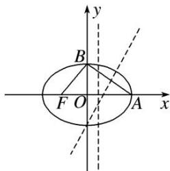
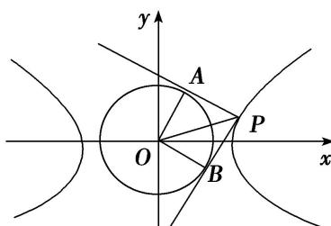

> [!faq]- 教师版例题解析
>
> > [!success]- **【答案】** C
>
> > [!note]- **【分析】**
> > 本题未单列分析。
>
> > [!note]- **【解析】**
> > 答案 A 解析 由题意可知，椭圆的上、下顶点在圆内，左、右顶点在圆外，则 $\left\{ \begin{array}{l} a > \frac{b}{2} + c, \\ b < \frac{b}{2} + c, \end{array} \right.$ 整理得 $\left\{ \begin{array}{l} (a - c)^2 > \frac{1}{4} (a^2 - c^2), \\ \sqrt{a^2 - c^2} < 2c, \end{array} \right.$ 解得 $\frac{\sqrt{5}}{5} < e < \frac{3}{5}$ .
> > 66. 已知双曲线 $C_1: \frac{x^2}{a^2} - \frac{y^2}{b^2} = 1 (a > 0, b > 0)$ , 圆 $C_2: x^2 + y^2 - 2ax + \frac{3}{4}a^2 = 0$ , 若双曲线 $C_1$ 的一条渐近线与圆 $C_2$ 有两个不同的交点, 则双曲线 $C_1$ 的离心率的取值范围是 ( ) A. $\left(1, \frac{2\sqrt{3}}{3}\right)$ B. $\left(\frac{2\sqrt{3}}{3}, +\infty\right)$ C. (1, 2) D. $(2, +\infty)$
> > 66. 答案 A 解析 由双曲线方程可得其渐近线方程为 $y = \pm \frac{b}{a} x$ ，即 $bx \pm ay = 0$ ，圆 $C_2: x^2 + y^2 - 2ax + \frac{3}{4} a^2 = 0$ 可化为 $(x - a)^2 + y^2 = \frac{1}{4} a^2$ ，圆心 $C_2$ 的坐标为 $(a,0)$ ，半径 $r = \frac{1}{2} a$ ，由双曲线 $C_1$ 的一条渐近线与圆 $C_2$ 有两个不同的交点，得 $\frac{|ab|}{\sqrt{a^2 + b^2}} < \frac{1}{2} a$ ，即 $c > 2b$ ，即 $c^2 > 4b^2$ ，又知 $b^2 = c^2 - a^2$ ，所以 $c^2 > 4(c^2 - a^2)$ ，即 $c^2 < \frac{4}{3} a^2$ ，所以 $e = \frac{c}{a} < \frac{2\sqrt{3}}{3}$ ，又知 $e > 1$ ，所以双曲线 $C_1$ 的离心率的取值范围为 $\left(1, \frac{2\sqrt{3}}{3}\right)$ ，故选 A.
> > 67. 已知双曲线 $\frac{x^2}{a^2} - \frac{y^2}{b^2} = 1 (a > 0, b > 0)$ 的渐近线与圆 $x^2 - 4x + y^2 + 2 = 0$ 相交，则双曲线的离心率的取值范围是 \_\_\_\_.
> > 67. 答案 (1, $\sqrt{2}$ ) 解析 双曲线的渐近线方程为 $y = \pm \frac{b}{a} x$ ，即 $bx \pm ay = 0$ ，圆 $x^{2} - 4x + y^{2} + 2 = 0$ 可化为 $(x - 2)^{2} + y^{2} = 2$ ，其圆心为 $(2, 0)$ ，半径为 $\sqrt{2}$ 。因为直线 $bx \pm ay = 0$ 和圆 $(x - 2)^{2} + y^{2} = 2$ 相交，所以 $\frac{|2b|}{\sqrt{a^2 + b^2}} < \sqrt{2}$ ，整理得 $b^{2} < a^{2}$ 。从而 $c^{2} - a^{2} < a^{2}$ ，即 $c^{2} < 2a^{2}$ ，所以 $e^{2} < 2$ 。又 $e > 1$ ，故双曲线的离心率的取值范围是 $(1, \sqrt{2})$ 。
> > 68. 若双曲线 $x^{2} - \frac{y^{2}}{b^{2}} = 1 (b > 0)$ 的一条渐近线与圆 $x^{2} + (y - 2)^{2} = 1$ 至多有一个交点，则双曲线离心率的取值范围是( )
> > A. (1, 2] B. [2, +∞) C. (1, $\sqrt{3}$ ] D. $[\sqrt{3}, +\infty)$
> > 68. 答案 A 解析 双曲线 $x^{2}-\frac{y^{2}}{b^{2}}=1(b>0)$ 的一条渐近线方程是 bx-y=0，由题意圆 $x^{2}+(y-2)^{2}=1$ 的圆心 $(0,2)$ 到 bx-y=0 的距离不小于 1，即 $\frac{2}{\sqrt{b^{2}+1}}\geq1$ ，则 $b^{2}\leq3$ ，那么离心率 $e\in(1,2]$ ，故选 A.
> > 69. 已知 $A(1, 2)$ , $B(-1, 2)$ , 动点 $P$ 满足 $\overrightarrow{AP} \perp \overrightarrow{BP}$ , 若双曲线 $\frac{x^2}{a^2} - \frac{y^2}{b^2} = 1 (a > 0, b > 0)$ 的一条渐近线与动点 $P$ 的轨迹没有公共点, 则双曲线的离心率 $e$ 的取值范围是 ( ) A. (1, 2) B. (1, 2] C. $(1, \sqrt{2})$ D. $(1, \sqrt{2}]$
> > 69. 答案 A 解析] 设 $P(x, y)$ ，由题设条件得动点 $P$ 的轨迹方程为 $(x - 1)(x + 1) + (y - 2)(y - 2) = 0$ ，即 $x^2 + (y - 2)^2 = 1$ ，它是以 $(0, 2)$ 为圆心，1 为半径的圆．又双曲线 $\frac{x^2}{a^2} - \frac{y^2}{b^2} = 1 (a > 0, b > 0)$ 的渐近线方程为 $y = \pm \frac{b}{a} x$ ，即 $bx \pm ay = 0$ ，因此由题意可得 $\frac{2a}{\sqrt{a^2 + b^2}} > 1$ ，即 $\frac{2a}{c} > 1$ ，则 $e = \frac{c}{a} < 2$ ，又 $e > 1$ ，故 $1 < e < 2$ ．
> > 70. 已知双曲线 $E: \frac{x^2}{a^2} - \frac{y^2}{b^2} = 1 (a > 0, b > 0)$ 的右顶点为 $A$ ，抛物线 $C: y^2 = 8ax$ 的焦点为 $F$ 。若在 $E$ 的渐近线上存在点 $P$ ，使得 $\overrightarrow{AP} \perp \overrightarrow{FP}$ ，则 $E$ 的离心率的取值范围是（）
> > A. (1, 2) B. $(1, \frac{3\sqrt{2}}{4}]$ C. $[\frac{3\sqrt{2}}{4}, +\infty)$ D. $(2, +\infty)$
> > 70. 答案 B 解析 由题意得， $A(a,0)$ ， $F(2a,0)$ ，设 $P(x_{0},\frac{b}{a}x_{0})$ ，由 $\overrightarrow{AP}\perp\overrightarrow{FP}$ ，得 $\overrightarrow{AP}\cdot\overrightarrow{PF}=0\Rightarrow\frac{c^{2}}{a^{2}}x_{0}^{2}-3ax_{0}+2a^{2}=0$ ，因为在 E 的渐近线上存在点 P，则 $\Delta\geq0$ ，即 $9a^{2}-4\times2a^{2}\times\frac{c^{2}}{a^{2}}\geq0\Rightarrow9a^{2}\geq8c^{2}\Rightarrow e^{2}\leq\frac{9}{8}\Rightarrow e\leq\frac{3\sqrt{2}}{4}$ ，又因为 E 为双曲线，则 $1<e\leq\frac{3\sqrt{2}}{4}$ 。故选 B.
> > 71. 已知圆 $(x - 1)^2 + y^2 = \frac{3}{4}$ 的一条切线 $y = kx$ 与双曲线 $C: \frac{x^2}{a^2} - \frac{y^2}{b^2} = 1 (a > 0, b > 0)$ 有两个交点，则双曲线 $C$ 的离心率的取值范围是（ ）A. $(1, \sqrt{3})$ B. $(1, 2)$ C. $(\sqrt{3}, +\infty)$ D. $(2, +\infty)$
> > 71. 答案 D 解析 由题意，圆心到直线的距离 $d = \frac{|k|}{\sqrt{1^2 + k^2}} = \frac{\sqrt{3}}{2}$ ，所以 $k = \pm \sqrt{3}$ ，因为圆 $(x - 1)^2 + y^2 = \frac{3}{4}$ 的一条切线 $y = kx$ 与双曲线 $C: \frac{x^2}{a^2} - \frac{y^2}{b^2} = 1 (a > 0, b > 0)$ 有两个交点，所以 $\frac{b}{a} > \sqrt{3}$ ，所以 $1 + \frac{b^2}{a^2} > 4$ ，所以 $e > 2$ .
> > 72. 已知直线 $l: y = kx + 2$ 过双曲线 $C: \frac{x^2}{a^2} - \frac{y^2}{b^2} = 1 (a > 0, b > 0)$ 的左焦点 $F$ 和虚轴的上端点 $B(0, b)$ ，且与圆 $x^2 + y^2 = 8$ 交于点 $M, N$ ，若 $|MN| \geq 2\sqrt{5}$ ，则双曲线的离心率 $e$ 的取值范围是（）A. $(1, \sqrt{6}]$ B. $(1, \frac{\sqrt{6}}{2}]$ C. $[\frac{\sqrt{6}}{2}, +\infty)$ D. $[\sqrt{6}, +\infty)$
> > 72. 答案 C 解析 设圆心到直线 l 的距离为 $d(d>0)$ ，因为 $|MN|\geq2\sqrt{5}$ ，所以 $2\sqrt{8-d^{2}}\geq2\sqrt{5}$ ，即 $0<d\leq\sqrt{3}$ 。又 $d=\frac{2}{\sqrt{1+k^{2}}}$ ，所以 $\frac{2}{\sqrt{1+k^{2}}}\leq\sqrt{3}$ ，解得 $|k|\geq\frac{\sqrt{3}}{3}$ 。由直线 l: y=kx+2 过双曲线 C: $\frac{x^{2}}{a^{2}}-\frac{y^{2}}{b^{2}}=1(a>0, b>0)$ 的左焦点 F 和虚轴的上端点 B(0, b)，得 $|k|=\frac{b}{c}$ 。所以 $\frac{b}{c}\geq\frac{\sqrt{3}}{3}$ ，即 $\frac{b^{2}}{c^{2}}\geq\frac{1}{3}$ ，所以 $\frac{c^{2}-a^{2}}{c^{2}}\geq\frac{1}{3}$ ，即 $1-\frac{1}{e^{2}}\geq\frac{1}{3}$ ，所以 $e\geq\frac{\sqrt{6}}{2}$ ，于是双曲线的离心率 e 的取值范围是 $\left[\frac{\sqrt{6}}{2}, +\infty\right)$ 。故选 C。
> > 73. 已知椭圆 $\frac{x^2}{a^2} + \frac{y^2}{b^2} = 1 (a > b > c > 0, a^2 = b^2 + c^2)$ 的左、右焦点分别为 $F_1, F_2$ ，若以 $F_2$ 为圆心， $b - c$ 为半径作圆 $F_2$ ，过椭圆上一点 $P$ 作此圆的切线，切点为 $T$ ，且 $|PT|$ 的最小值不小于 $\frac{\sqrt{3}}{2} (a - c)$ ，则椭圆的离心率 $e$ 的取值范围是 \_\_\_\_.
> > 73. 答案 $\left[\frac{3}{5}, \frac{\sqrt{2}}{2}\right]$ 解析 因为 $|PT| = \sqrt{|PF_2|^2 - (b - c)^2} (b > c)$ ，而 $|PF_2|$ 的最小值为 $a - c$ ，所以 $|PT|$ 的最小值为 $\sqrt{(a - c)^2 - (b - c)^2}$ . 依题意，有 $\sqrt{(a - c)^2 - (b - c)^2} \geq \frac{\sqrt{3}}{2} (a - c)$ ，所以 $(a - c)^2 \geq 4(b - c)^2$ ，所以 $a - c \geq 2(b - c)$ ，所以 $a + c \geq 2b$ ，所以 $(a + c)^2 \geq 4(a^2 - c^2)$ ，所以 $5c^2 + 2ac - 3a^2 \geq 0$ ，所以 $5e^2 + 2e - 3 \geq 0$ ，①．又 $b > c$ ，所以 $b^2 > c^2$ ，所以 $a^2 - c^2 > c^2$ ，所以 $2e^2 < 1$ ，②．联立①②，得 $\frac{3}{5} \leq e < \frac{\sqrt{2}}{2}$ .
> > 74. 已知 $A, B, F$ 分别是椭圆 $x^{2} + \frac{y^{2}}{b^{2}} = 1 (0 < b < 1)$ 的右顶点、上顶点、左焦点，设 $\triangle ABF$ 的外接圆的圆心坐
> > 标为 $(p, q)$ 。若 $p + q > 0$ ，则椭圆的离心率的取值范围为 \_\_\_\_.
> > 74. 答案 $\left(0, \frac{\sqrt{2}}{2}\right)$ 解析 如图所示，线段 FA 的垂直平分线为 $x=\frac{1-\sqrt{1-b^{2}}}{2}$ ，线段 AB 的中点为 $\left(\frac{1}{2}, \frac{b}{2}\right)$ .
> > 
> > 因为 $k_{AB} = -b$ ，所以线段 AB 的垂直平分线的斜率 $k = \frac{1}{b}$ ，所以线段 AB 的垂直平分线方程为 $y - \frac{b}{2} = \frac{1}{b} \left( x - \frac{1}{2} \right)$ 。把 $x = \frac{1 - \sqrt{1 - b^{2}}}{2} = p$ 代入上述方程可得 $y = \frac{b^{2} - \sqrt{1 - b^{2}}}{2b} = q$ 。因为 $p + q > 0$ ，所以 $\frac{1 - \sqrt{1 - b^{2}}}{2} + \frac{b^{2} - \sqrt{1 - b^{2}}}{2b} > 0$ ，化为 $b > \sqrt{1 - b^{2}}$ 。又 0 < b < 1，解得 $\frac{1}{2} < b^{2} < 1$ ，即 $-1 < -b^{2} < -\frac{1}{2}$ ，所以 $0 < 1 - b^{2} < \frac{1}{2}$ ，所以 $e = \frac{c}{a} = c = \sqrt{1 - b^{2}} \in \left( 0, \frac{\sqrt{2}}{2} \right)$ 。
> > 75. 已知双曲线 $C_1: \frac{x^2}{a^2} - \frac{y^2}{b^2} = 1$ 与圆 $C_2: x^2 + y^2 = b^2$ (其中 $a > 0, b > 0$ ), 若在 $C_1$ 上存在点 $P$ , 使得由点 $P$ 向 $C_2$ 所作的两条切线互相垂直, 则双曲线 $C_1$ 的离心率的取值范围是 \_\_\_\_.
> > 75. 答案 $\left[\frac{\sqrt{6}}{2}, +\infty\right]$ 解析 由题意，根据圆的性质，可知四边形 $PAOB$ 是正方形，所以 $|OP| = \sqrt{2} b$ ；因为 $|OP| = \sqrt{2} b \geq a$ ，所以 $\frac{b}{a} \geq \frac{1}{\sqrt{2}}$ ，所以 $e = \frac{c}{a} = \frac{\sqrt{a^2 + b^2}}{a} = \sqrt{1 + \left(\frac{b}{a}\right)^2} \geq \sqrt{1 + \frac{1}{2}} = \frac{\sqrt{6}}{2}$ ；所以双曲线离心率 $e$ 的取值范围是 $\left[\frac{\sqrt{6}}{2}, +\infty\right]$ ，故答案为： $\left[\frac{\sqrt{6}}{2}, +\infty\right]$ .
> > 
> > ## 2. 椭圆(双曲线)+圆(抛物线)求值型
> > 椭圆(双曲线)+圆(抛物线)型求值的基本思路是借助椭圆、双曲线、抛物线或圆的相关知识，结合题设条件建立a，b，c的等量关系，转化为e的方程求解.
