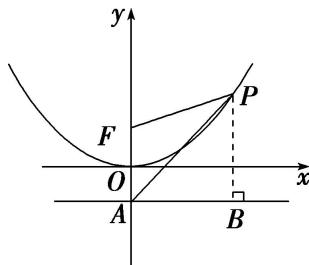

> [!faq]- 教师版例题解析
>
> > [!success]- **【答案】** B
>
> > [!note]- **【分析】**
> > 本题未单列分析。
>
> > [!note]- **【解析】**
> > 答案 B 解析 法一：由抛物线方程知 $A(0, -1)$ ，过点 $P$ 作 $PB$ 垂直准线于点 $B$ ，如图．由抛物线定义可知 $|PF|=|PB|$ ，则 $|PA|=m|PF|=m|PB|$ ，即 $m=\frac{|PA|}{|PB|}=\frac{1}{\sin\angle PAB}$ 。若m最大，则 $\sin\angle PAB$ 最小，此时直线PA与抛物线相切。设直线PA的方程为y=kx-1，代入 $x^{2}=4y$ 得 $x^{2}=4kx-4$ ，即 $x^{2}-4kx+4=0$ ，令 $A=16k^{2}-16=0$ ，解得 $k=\pm1$ ，可得 $P(\pm2,1)$ ， $B(\pm2,-1)$ ，所以 $|PF|=|PB|=|AB|=2$ ，所以 $|PA|=2\sqrt{2}$ 。因为点P在以A，F为焦点的椭圆上，所以 $2c=|AF|=2$ ， $2a=|PA|+|PF|=2\sqrt{2}+2$ ，所以椭圆的离心率 $e=\frac{c}{a}=\frac{2c}{2a}=\frac{2}{2\sqrt{2}+2}=\sqrt{2}-1$ ，故选B.
> > 
> > 法二：过点 $P$ 作 $PB$ 垂直准线于点 $B$ 。设 $P(x, y)$ 。因为 $A$ 是抛物线 $x^2 = 4y$ 的对称轴与准线的交点，点 $F$ 为抛物线的焦点，所以 $A(0, -1)$ ， $F(0, 1)$ ，则 $m = \frac{|PA|}{|PF|} = \sqrt{\frac{(y + 1)^2 + x^2}{(y - 1)^2 + x^2}} = \sqrt{\frac{(y + 1)^2 + 4y}{(y - 1)^2 + 4y}} = \sqrt{1 + \frac{4y}{y^2 + 2y + 1}}$ 。当 $y = 0$ 时， $m = 1$ ；当 $y > 0$ 时， $m = \sqrt{1 + \frac{4y}{y^2 + 2y + 1}} = \sqrt{1 + \frac{4}{y + \frac{1}{y} + 2}} \leq \sqrt{1 + \frac{4}{2 + 2\sqrt{y \cdot \frac{1}{y}}}} = \sqrt{2}$ ，当且仅当 $y = 1$ 时取等号。当 $m$ 取得最大值时， $P(\pm 2, 1)$ ， $B(\pm 2, -1)$ ，所以 $|PF| = |PB| = |AB| = 2$ ，所以 $|PA| = 2\sqrt{2}$ 。因为点 $P$ 在以 $A$ ， $F$ 为焦点的椭圆上，所以 $2c = |AF| = 2$ ， $2a = |PA| + |PF| = 2\sqrt{2} + 2$ ，所以椭圆的离心率 $e = \frac{c}{a} = \frac{2c}{2a} = \frac{2}{2\sqrt{2} + 2} = \sqrt{2} - 1$ ，
> >
> > 故选 **B**.
