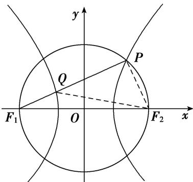

> [!faq]- 教师版例题解析
>
> > [!success]- **【答案】** A
>
> > [!note]- **【分析】**
> > 本题未单列分析。
>
> > [!note]- **【解析】**
> > 答案 A 解析 如图，连接 $PF_{2}$ ， $QF_{2}$ 。由 $|PQ|=2|QF_{1}|$ ，可设 $|QF_{1}|=m$ ，则 $|PQ|=2m$ ， $|PF_{1}|=3m$ ；由 $|PF_{1}|-|PF_{2}|=2a$ ，得 $|PF_{2}|=|PF_{1}|-2a=3m-2a$ ；由 $|QF_{2}|-|QF_{1}|=2a$ ，得 $|QF_{2}|=|QF_{1}|+2a=m+2a$ 。∵点 $P$ 在以 $F_{1}F_{2}$ 为直径的圆上，∴ $PF_{1} \perp PF_{2}$ ，∴ $|PF_{1}|^{2}+|PF_{2}|^{2}=|F_{1}F_{2}|^{2}$ ， $|PQ|^{2}+|PF_{2}|^{2}=|QF_{2}|^{2}$ 。由 $|PQ|^{2}+|PF_{2}|^{2}=|QF_{2}|^{2}$ ，得 $(2m)^{2}+(3m-2a)^{2}=(m+2a)^{2}$ ，解得 $m=\frac{4}{3}a$ ，∴ $|PF_{1}|=3m=4a$ ， $|PF_{2}|=3m-2a=2a$ 。∵ $|PF_{1}|^{2}+|PF_{2}|^{2}=|F_{1}F_{2}|^{2}$ ， $|F_{1}F_{2}|=2c$ ，∴ $(4a)^{2}+(2a)^{2}=(2c)^{2}$ ，化简得 $c^{2}=5a^{2}$ ，∴双曲线的离心率 $e=\sqrt{\frac{c^{2}}{a^{2}}}=\sqrt{5}$ ，故选 A.
> > 
