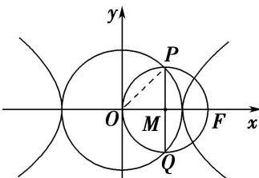

> [!faq]- 《专题04 椭圆(双曲线)＋圆(抛物线)模型-圆锥曲线》例题解析
>
> > [!success]- **【答案】** A
>
> > [!note]- **【解析】**
> > 答案 A 解析 令双曲线 $C: \frac{x^2}{a^2} - \frac{y^2}{b^2} = 1 (a > 0, b > 0)$ 的右焦点 $F$ 的坐标为 $(c,0)$ ，则 $c = \sqrt{a^2 + b^2}$ 。如图所示，由圆的对称性及条件 $|PQ| = |OF|$ 可知， $PQ$ 是以 $OF$ 为直径的圆的直径，且 $PQ \perp OF$ . 设垂足为 $M$ ，连接 $OP$ ，则 $|OP| = a$ ， $|OM| = |MP| = \frac{c}{2}$ ，由 $|OM|^2 + |MP|^2 = |OP|^2$ ，得 $\left(\frac{c}{2}\right)^2 + \left(\frac{c}{2}\right)^2 = a^2$ ， $\therefore \frac{c}{a} = \sqrt{2}$ ，即离心率 $e = \sqrt{2}$ 。故选 A.
> >
> > 
