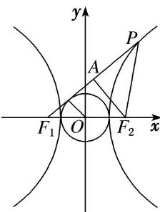

> [!faq]- 《专题04 椭圆(双曲线)＋圆(抛物线)模型-圆锥曲线》例题解析
>
> > [!success]- **【答案】** B
>
> > [!note]- **【分析】**
> > 本题未单列分析。
>
> > [!note]- **【解析】**
> > 答案 B 解析 取线段 $PF_{1}$ 的中点为 $A$ ，连接 $AF_{2}$ ，又 $|PF_{2}| = |F_{1}F_{2}|$ ，则 $AF_{2} \perp PF_{1}$ ， $\because$ 直线 $PF_{1}$ 与圆 $x^{2} + y^{2} = a^{2}$ 相切， $\therefore |AF_{2}| = 2a$ ， $\because |PF_{2}| = |F_{1}F_{2}| = 2c$ ， $\therefore |PF_{1}| = 2a + 2c$ ， $\therefore |PA| = \frac{1}{2} \cdot |PF_{1}| = a + c$ ，则在 Rt△APF₂ 中， $4c^{2} = (a + c)^{2} + 4a^{2}$ ，化简得 $(3c - 5a)(a + c) = 0$ ，则双曲线的离心率为 $\frac{5}{3}$ .
> > 
