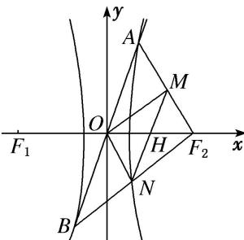

> [!faq]- 《专题04 椭圆(双曲线)＋圆(抛物线)模型-圆锥曲线》例题解析
>
> > [!success]- **【答案】** C
>
> > [!note]- **【分析】**
> > 本题未单列分析。
>
> > [!note]- **【解析】**
> > 答案 C 解析 设双曲线的焦距为 $2c$ ， $MN$ 与 $x$ 轴交于点 $H$ ，如图可知， $OH = \frac{MN}{2} = \frac{AB}{4} = \frac{c}{2}$ ，所以 $AB = 2c$ ，由 $\left\{ \begin{array}{l} y = 2\sqrt{2}x, \\ b^2x^2 - a^2y^2 = a^2b^2, \end{array} \right.$ 可得 $x = \pm \sqrt{\frac{a^2b^2}{b^2 - 8a^2}}$ ，所以 $AB = 6\sqrt{\frac{a^2b^2}{b^2 - 8a^2}} = 2c$ ，所以有 $18a^2c^2 - 9a^4 = c^4$ ，解得 $e^2 = 9 + 6\sqrt{2}$ ，所以离心率 $e = \sqrt{6} + \sqrt{3}$ ，故选 C.
> >
> > 
