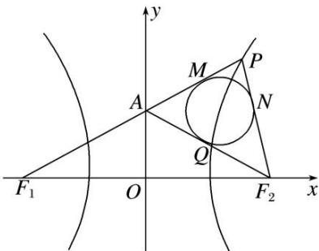

> [!faq]- 教师版对点训练解析
>
> > [!success]- **【答案】** 详见解析
>
> > [!note]- **【分析】**
> > 本题未单列分析。
>
> > [!note]- **【解析】**
> > 答案 $\frac{4\sqrt{3}}{3}$ 解析 如图所示，设 $PF_{1}, PF_{2}$ 分别与 $\triangle PAF_{2}$ 的内切圆切于 $M, N$ ，依题意，有 $|MA| = |AQ|$ ， $|NP| = |MP|$ ， $|NF_{2}| = |QF_{2}|$ ， $|AF_{1}| = |AF_{2}| = |QA| + |QF_{2}|$ ， $2a = |PF_{1}| - |PF_{2}| = (|AF_{1}| + |MA| + |MP|) - (|NP| + |NF_{2}|) = 2|QA| = 2\sqrt{3}$ ，故 $a = \sqrt{3}$ ，从而 $e = \frac{c}{a} = \frac{4}{\sqrt{3}} = \frac{4\sqrt{3}}{3}$ .
> > 
