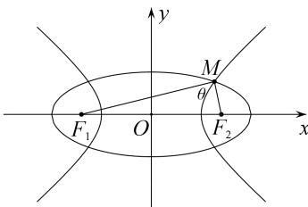

# 专题05 共焦点椭圆、双曲线模型

秒杀结论 已知椭圆 $C_1: \frac{x^2}{a^2} + \frac{y^2}{b^2} = 1$ (其中 $a > b > 0$ ) 与双曲线 $C_2: \frac{x^2}{m^2} - \frac{y^2}{n^2} = 1$ (其中 $m > 0, n > 0$ ) 共焦点， $e_1, e_2$ 分别为 $C_1, C_2$ 的离心率， $M$ 是 $C_1, C_2$ 的一个交点， $\theta = \angle F_1MF_2$ ，则

I. $|MF_1| = a + m, |PF_2| = a - m;$ II. $\frac{\sin^2\frac{\theta}{2}}{e_1^2} + \frac{\cos^2\frac{\theta}{2}}{e_2^2} = 1.$

![[高中/总复习/专题/圆锥曲线/专题05 共焦点椭圆、双曲线模型-圆锥曲线/专题05_共焦点椭圆_双曲线模型/方法技巧/方法技巧.md]]
![[高中/总复习/专题/圆锥曲线/专题05 共焦点椭圆、双曲线模型-圆锥曲线/专题05_共焦点椭圆_双曲线模型/例题选讲/例题选讲.md]]
![[高中/总复习/专题/圆锥曲线/专题05 共焦点椭圆、双曲线模型-圆锥曲线/专题05_共焦点椭圆_双曲线模型/对点训练/对点训练.md]]
![[高中/总复习/专题/圆锥曲线/专题05 共焦点椭圆、双曲线模型-圆锥曲线/专题05_共焦点椭圆_双曲线模型/例题选讲_2/例题选讲_2.md]]
![[高中/总复习/专题/圆锥曲线/专题05 共焦点椭圆、双曲线模型-圆锥曲线/专题05_共焦点椭圆_双曲线模型/对点训练_2/对点训练_2.md]]
