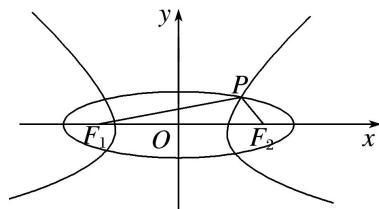

> [!faq]- 教师版对点训练解析
>
> > [!success]- **【答案】** A
>
> > [!note]- **【分析】**
> > 本题未单列分析。
>
> > [!note]- **【解析】**
> > 答案 A 通解 如图所示，设椭圆的长半轴长为 $a_1$ ，双曲线的实半轴长为 $a_2$ ，则根据椭圆及双曲线的定义： $|PF_1| + |PF_2| = 2a_1$ ， $|PF_1| - |PF_2| = 2a_2$ ， $\therefore |PF_1| = a_1 + a_2$ ， $|PF_2| = a_1 - a_2$ ，设 $|F_1F_2| = 2c$ ， $\angle F_1PF_2 = \frac{2\pi}{3}$ ，则在 $\triangle PF_1F_2$ 中，由余弦定理得 $4c^2 = (a_1 + a_2)^2 + (a_1 - a_2)^2 - 2(a_1 + a_2)(a_1 - a_2)\cos \frac{2\pi}{3}$ ，化简得 $3a_1^2 + a_2^2 = 4c^2$ ，该式可变成 $\frac{3}{e_1^2} + \frac{1}{e_2^2} = 4$ 。故选 A.
> > 
> > 秒杀 由已知 $\frac{\theta}{2} = \frac{\pi}{3}$ ，又由 $\frac{\sin^2\frac{\theta}{2}}{e_1^2} + \frac{\cos^2\frac{\theta}{2}}{e_2^2} = 1$ ，得 $\frac{3}{e_1^2} + \frac{1}{e_2^2} = 4$ 。
> >
> > 故选 **A**.
