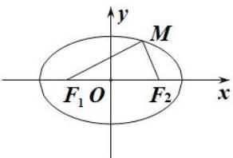
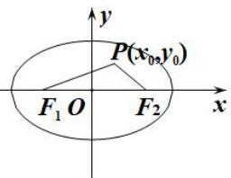
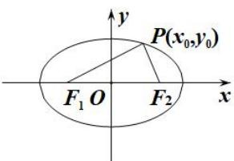
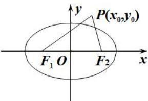
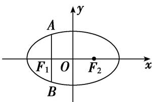
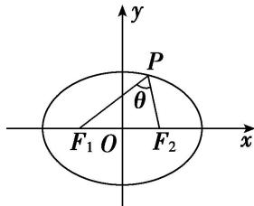
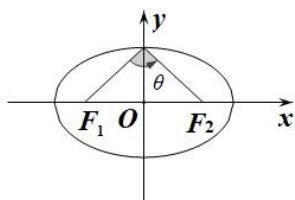
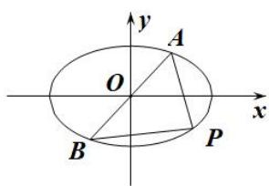
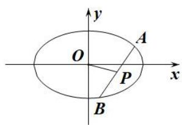

# 专题06 椭圆模型

## 椭圆秒杀小题常用结论

(1)椭圆定义： $|MF_{1}|+|MF_{2}|=2a(2a>|F_{1}F_{2}|)$ . 如图(1)

图(1)

图(2)

图(3)

图(4)

(2)点 $P(x_0, y_0)$ 和椭圆 $\frac{x^2}{a^2} + \frac{y^2}{b^2} = 1 (a > b > 0)$ 的关系

$P(x_0, y_0)$ 在椭圆内 $\Leftrightarrow \frac{x_0^2}{a^2} + \frac{y_0^2}{b^2} < 1$ ; $P(x_0, y_0)$ 在椭圆上 $\Leftrightarrow \frac{x_0^2}{a^2} + \frac{y_0^2}{b^2} = 1$ ; $P(x_0, y_0)$ 在椭圆外 $\Leftrightarrow \frac{x_0^2}{a^2} + \frac{y_0^2}{b^2} > 1$ .

(3)如图(5)，椭圆的通径(过焦点且垂直于长轴的弦)长为 $|AB|=\frac{2b^{2}}{a}$ ，通径是最短的焦点弦．过焦点最长弦为长轴．过原点最长弦为长轴长2a，最短弦为短轴长2b.

图(5)

图(6)

图(7)

(4)焦点三角形：椭圆上的点 $P(x_0, y_0)$ 与两焦点 $F_1$ ， $F_2$ 构成的 $\triangle PF_1F_2$ 叫做焦点三角形．若 $r_1 = |PF_1|$ ， $r_2 = |PF_2|$ ， $\angle F_1PF_2 = \theta$ ， $\triangle PF_1F_2$ 的面积为 $S$ ，则在椭圆 $\frac{x^2}{a^2} + \frac{y^2}{b^2} = 1 (a > b > 0)$ 中如图(6):

① $\triangle PF_{1}F_{2}$ 的周长为 $2(a+c)$ . ② $S=b^{2}\tan\frac{\theta}{2}$ .

(5)如图(7) $P$ 为椭圆 $\frac{x^2}{a^2} +\frac{y^2}{b^2} = 1(a > b > 0)$ 上的动点， $F_{1}$ ， $F_{2}$ 分别为椭圆的左、右焦点，当椭圆上点 $P$ 在短轴端点时与两焦点连线的夹角最大.

(6) $P$ 为椭圆 $\frac{x^2}{a^2} +\frac{y^2}{b^2} = 1(a > b > 0)$ 上的点， $F_{1}$ ， $F_{2}$ 分别为椭圆的左、右焦点，则 $P$ 到焦点的最长距离为 $\underline{a}$ $+c$ ，最短距离为 $\underline{a - c}$

(7)如图(8)设 P, A, B 是椭圆 $\frac{x^{2}}{a^{2}} + \frac{y^{2}}{b^{2}} = 1 (a > b > 0)$ 上不同的三点，其中 A, B 关于原点对称，则 $k_{PA} \cdot k_{PB} = -\frac{b^{2}}{a^{2}} = e^{2} - 1$ .

图(8)

图(9)

(8)如图(9)设 A, B 是椭圆 $\frac{x^{2}}{a^{2}} + \frac{y^{2}}{b^{2}} = 1 (a > b > 0)$ 上不同的两点，P 为弦 AB 的中点，则 $k_{AB} \cdot k_{OP} = -\frac{b^{2}}{a^{2}} = e^{2} - 1$ .

![[高中/总复习/专题/圆锥曲线/专题06 椭圆模型-圆锥曲线/专题06_椭圆模型/例题选讲/例题选讲.md]]
![[高中/总复习/专题/圆锥曲线/专题06 椭圆模型-圆锥曲线/专题06_椭圆模型/对点训练/对点训练.md]]
