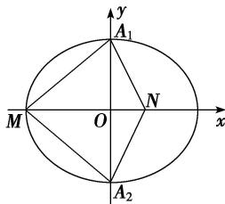

> [!faq]- 《专题06 椭圆模型-圆锥曲线》例题解析
>
> > [!success]- **【答案】** C
>
> > [!note]- **【解析】**
> > 答案 C 解析 由题意以及选项的值可知： $\frac{S_{\triangle MA_{1}A_{2}}}{S_{\triangle NA_{1}A_{2}}}$ 是常数，取 M 为椭圆的左顶点，由椭圆的性质可知 N 在 x 的正半轴上，如图：则 $A_{1}(0,2)$ ， $A_{2}$ 是 $(0,-2)$ ， $M(-3,0)$ ，由 $OM\cdot ON=OA_{1}^{2}$ ，可得 $ON=\frac{4}{3}$ ，则 $\frac{S_{\triangle MA_{1}A_{2}}}{S_{\triangle NA_{1}A_{2}}}=\frac{\frac{1}{2}|OM|\cdot|A_{1}A_{2}|}{\frac{1}{2}|ON|\cdot|A_{1}A_{2}|}=\frac{|OM|}{|ON|}=\frac{3}{\frac{4}{3}}=\frac{9}{4}$ ，故选 C.
> >
> > 
> >
> > ## 【对点训练】
