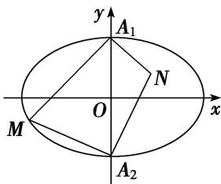

<!-- question-source:start -->
(8)如图所示， $A_{1}$ ， $A_{2}$ 是椭圆 $C: \frac{x^2}{9} + \frac{y^2}{4} = 1$ 的短轴端点，点 $M$ 在椭圆上运动，且点 $M$ 不与 $A_{1}$ ， $A_{2}$ 重合，点 $N$ 满足 $NA_{1} \perp MA_{1}$ ， $NA_{2} \perp MA_{2}$ ，则 $\frac{S_{\triangle MA_1A_2}}{S_{\triangle NA_1A_2}} = (\quad)$

A. $\frac{3}{2}$ B. $\frac{2}{3}$ C. $\frac{9}{4}$ D. $\frac{4}{9}$
<!-- question-source:end -->

![[高中/总复习/专题/圆锥曲线/专题06 椭圆模型-圆锥曲线/专题06_椭圆模型/例题选讲/例题/answers/Q00033025A1.md]]
