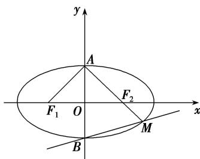

> [!faq]- 教师版例题解析
>
> > [!success]- **【答案】** B
>
> > [!note]- **【分析】**
> > 本题未单列分析。
>
> > [!note]- **【解析】**
> > 答案 B 解析 由题意，椭圆 $\frac{x^{2}}{a^{2}}+\frac{y^{2}}{b^{2}}=1(a>b>0)$ ，且满足 $\angle F_{1}AF_{2}=120^{\circ}$ ，如图所示，
> > 
> > 则在 $\triangle AF_2O$ 中， $|OA| = b, |AF_2| = a$ ，且 $\angle OAF_2 = 60^\circ$ ，所以 $a = 2b$ ，不妨设 $b = 1$ ，则 $a = 2$ ，所以 $c = \sqrt{a^2 - c^2} = \sqrt{3}$ ，则椭圆的方程为 $\frac{x^2}{4} + y^2 = 1$ ，又由 $A(0,1)$ ， $F_2(\sqrt{3}, 0)$ ，所以 $kAF_2 = -\frac{\sqrt{3}}{3}$ ，所以直线 $AF_2$ 的方程为 $y = -\frac{\sqrt{3}}{3} x + 1$ ，联立方程组 $\left\{ \begin{array}{l} y = -\frac{\sqrt{3}}{3} x + 1 \\ \frac{x^2}{4} + y^2 = 1 \end{array} \right.$ ，整理得 $7x^2 - 8\sqrt{3} x = 0$ ，解得 $x = 0$ 或 $x = \frac{8\sqrt{3}}{7}$ ，把 $x = \frac{8\sqrt{3}}{7}$ 代入直线 $y = -\frac{\sqrt{3}}{3} x + 1$ ，解得 $y = -\frac{1}{7}$ ，即 $M\left[\frac{8\sqrt{3}}{7}, -\frac{1}{7}\right]$ ，又由点 $B(0, -1)$ ，所以 $BM$ 的斜率为 $k_{BM} = \frac{-\frac{1}{7} - (-1)}{\frac{8\sqrt{3}}{7} - 0}$
> > $= \frac{\sqrt{3}}{4}$ ，
> >
> > 故选 **B**.
