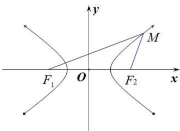
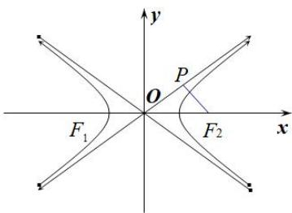
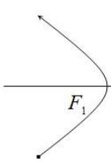
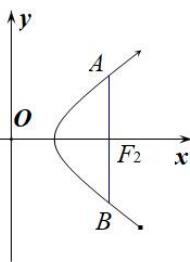
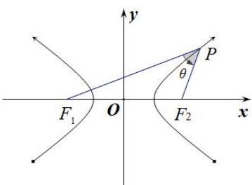
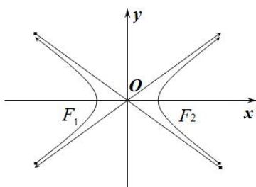
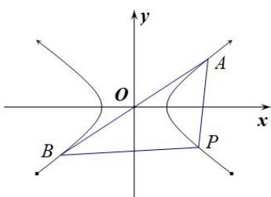
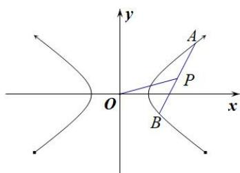

# 专题07 双曲线模型

## 双曲线线秒杀小题常用结论

(1)双曲线定义： $\|MF_{1}|-|MF_{2}\|=2a(2a<|F_{1}F_{2}|)$ . 如图(10)

图(10)

图(11)

图(12)

(2)如图(11)双曲线的焦点到其渐近线的距离为 b. 与双曲线 $\frac{x^{2}}{a^{2}} - \frac{y^{2}}{b^{2}} = 1 (a > 0, b > 0)$ 有共同渐近线的方程可表示为 $\frac{x^{2}}{a^{2}} - \frac{y^{2}}{b^{2}} = t (t \neq 0)$ .

(3)如图(12)同支的焦点弦中最短的为通径(过焦点且垂直于长轴的弦)，其长为 $\frac{2b^2}{a}$ ，异支的弦中最短的为实轴，其长为 $2a$ ；

(4)如图(13)P 是双曲线上不同于实轴两端点的任意一点， $F_{1}$ 、 $F_{2}$ 分别为双曲线的左、右焦点，则 $S_{\triangle PF1F2}=b^{2}\frac{1}{\tan\frac{\theta}{2}}$ ，其中 $\theta$ 为 $\angle F_{1}PF_{2}$ .

图(13)

图(14)

(5)如图(14)双曲线 $\frac{x^2}{a^2} -\frac{y^2}{b^2} = 1(a > 0,b > 0)$ 的渐近线 $y = \pm \frac{b}{a} x$ 的斜率 $k = \pm \frac{b}{a}$ 与离心率 $e$ 的关系： $e = \sqrt{1 + (\frac{b}{a})^2} = \sqrt{1 + k^2}$

(6)若 P 是双曲线右支上一点， $F_{1}$ 、 $F_{2}$ 分别为双曲线的左、右焦点，则 $\left|PF_{1}\right|_{\min}=a+c,\quad\left|PF_{2}\right|_{\min}=c-a;$

(7)如图(15)设 P, A, B 是双曲线 $\frac{x^{2}}{a^{2}} - \frac{y^{2}}{b^{2}} = 1 (a > b > 0)$ 上不同的三点，其中 A, B 关于原点对称，则 $k_{PA} \cdot k_{PB} = \frac{b^{2}}{a^{2}} = e^{2} - 1$ .

图(15)

(8)如图(16)设 A, B 是双曲线 $\frac{x^{2}}{a^{2}} - \frac{y^{2}}{b^{2}} = 1 (a > b > 0)$ 上不同的两点，P 为弦 AB 的中点，则 $k_{AB} \cdot k_{OP} = \frac{b^{2}}{a^{2}} = e^{2} - 1$ .
![[高中/总复习/专题/圆锥曲线/专题07 双曲线模型-圆锥曲线/专题07_双曲线模型/例题选讲/例题选讲.md]]
![[高中/总复习/专题/圆锥曲线/专题07 双曲线模型-圆锥曲线/专题07_双曲线模型/对点训练/对点训练.md]]
