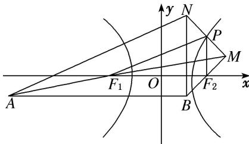

> [!faq]- 《专题07 双曲线模型-圆锥曲线》例题解析
>
> > [!success]- **【答案】** A
>
> > [!note]- **【分析】**
> > 本题未单列分析。
>
> > [!note]- **【解析】**
> > 答案 A 解析 如图，设 \(MN\) 的中点为 \(P\)。\$\because F\_1\$ 为 \(MA\) 的中点，\(F\_2\) 为 \(MB\) 的中点，\$\therefore |AN| = 2|PF\_1|\)，\(|BN| = 2|PF\_2|\)，又 \(|AN| - |BN| = 12\)，\$\therefore |PF\_1| - |PF\_2| = 6 = 2a\$，\$\therefore a = 3\$。故选 A.
> > 
