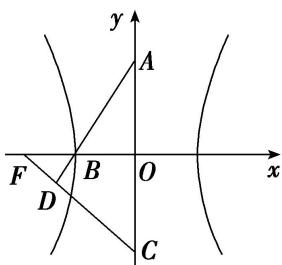

<!-- question-source:start -->
17. 如图, 双曲线的中心在坐标原点 $O$ , $A$ , $C$ 分别是双曲线虚轴的上、下端点, $B$ 是双曲线的左顶点, $F$ 为双曲线的左焦点, 直线 $AB$ 与 $FC$ 相交于点 $D$ . 若双曲线的离心率为 2 , 则 $\angle BDF$ 的余弦值是 \_\_\_\_.

<!-- question-source:end -->

![[高中/总复习/专题/圆锥曲线/专题07 双曲线模型-圆锥曲线/专题07_双曲线模型/对点训练/题目/answers/Q00032195A1.md]]
