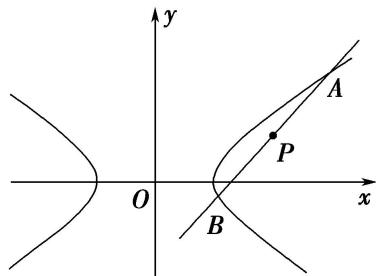

> [!faq]- 教师版对点训练解析
>
> > [!success]- **【答案】** D
>
> > [!note]- **【分析】**
> > 本题未单列分析。
>
> > [!note]- **【解析】**
> > 答案 D 解析 法一：由已知可得点 P 的位置如图所示，且直线 AB 的斜率存在，设 AB 的斜率为 k，则 AB 的方程为 $y-2=k(x-4)$ ，即 $y=k(x-4)+2$ ，由 $\left\{\begin{aligned}y&=k\quad x-4\quad+2,\\ \frac{x^{2}}{2}-y^{2}&=1,\end{aligned}\right.$ 消去 y 得 $(1-2k^{2})x^{2}+(16k^{2}-8k)x-32k^{2}+32k-10=0$ ，设 $A(x_{1},y_{1})$ ， $B(x_{2},y_{2})$ ，由根与系数的关系得 $x_{1}+x_{2}=\frac{-16k^{2}+8k}{1-2k^{2}}$ ， $x_{1}x_{2}=\frac{-32k^{2}+32k-10}{1-2k^{2}}$ ，因为 $P(4,2)$ 为 AB 的中点，所以 $\frac{-16k^{2}+8k}{1-2k^{2}}=8$ ，解得 k=1，满足 $\Delta>0$ ，所以 $x_{1}+x_{2}=8$ ， $x_{1}x_{2}=10$ ，所以 $|AB|=\sqrt{1+1^{2}}\times\sqrt{8^{2}-4\times10}=4\sqrt{3}$ ，故选 D.
> > 
> > 法二：由已知可得点 $P$ 的位置如法一中图所示，且直线 $AB$ 的斜率存在，设 $AB$ 的斜率为 $k$ ，则 $AB$ 的方程为 $y - 2 = k(x - 4)$ ，即 $y = k(x - 4) + 2$ ，设 $A(x_{1},y_{1}),B(x_{2},y_{2})$ ，则 $\left\{ \begin{array}{l}x_1^2 -2y_1^2 -2 = 0,\\ x_2^2 -2y_2^2 -2 = 0, \end{array} \right.$ 所以 $(x_{1} + x_{2})(x_{1}-x_{2}) = 2(y_{1} + y_{2})(y_{1} - y_{2})$ ，因为 $P(4,2)$ 为 $AB$ 的中点，所以 $k = \frac{y_1 - y_2}{x_1 - x_2} = 1$ ，所以 $AB$ 的方程为 $y = x - 2$ ，由 $\left\{ \begin{array}{ll}y = x - 2, & \\ \frac{x^2}{2} -y^2 = 1, & \text{消去} y\text{得} x^{2} - 8x + 10 = 0, \text{所以} x_{1} + x_{2} = 8, x_{1}x_{2} = 10, \text{所以}|AB| = \sqrt{1 + 1^2}\times \sqrt{8^2 - 4\times 10} = \\ 4\sqrt{3}, & \text{
> >
> > 故选 **D**.} \end{array} \right.$
