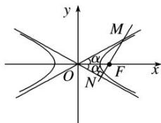

> [!faq]- 《专题07 双曲线模型(教师版)》例题解析
>
> > [!success]- **【答案】** B
>
> > [!note]- **【解析】**
> > 答案 B 解析 由已知得双曲线的两条渐近线方程为 $y = \pm \frac{1}{\sqrt{3}} x$ . 设两渐近线的夹角为 $2\alpha$ ，则有 $\tan \alpha = \frac{1}{\sqrt{3}} = \frac{\sqrt{3}}{3}$ ，所以 $\alpha = 30^\circ$ 。所以 $\angle MON = 2\alpha = 60^\circ$ 。又 $\triangle OMN$ 为直角三角形，由于双曲线具有对称性，不妨设 $MN \perp ON$ ，如图所示。
> >
> > 
> >
> > 在 Rt△ONF 中，|OF|=2，则|ON|= $\sqrt{3}$ 。则在 Rt△OMN 中，|MN|=|ON|·tan $2\alpha=\sqrt{3}\cdot\tan60^{\circ}=3$ 。
> >
> > 故选 **B**.
