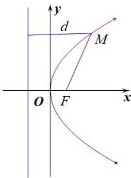
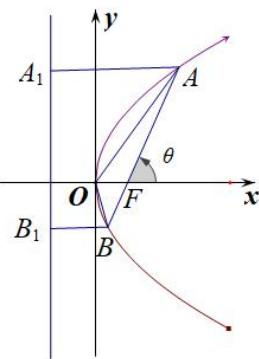
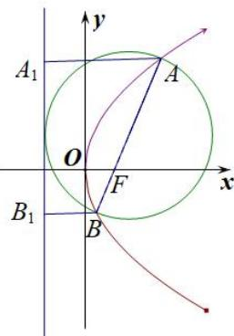
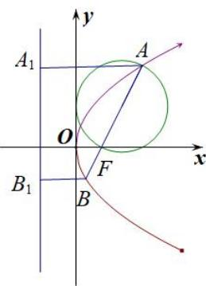
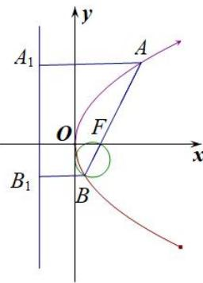
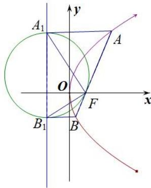
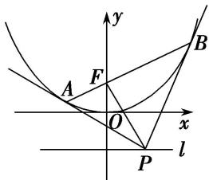

# 专题08 抛物线模型

## 抛物线秒杀小题常用结论

(1)抛物线定义： $|MF|=d(d$ 为M点到准线的距离). 如图(17)

图(17)

图(18)

(2)设 A, B 是抛物线 $y^{2}=2px(p>0)$ 上不同的两点，P 为弦 AB 的中点，则 $k_{AB}\cdot y_{0}=p$ .

(3)以抛物线 $y^{2} = 2px (p > 0)$ 为例，设 $AB$ 是抛物线的过焦点的一条弦(焦点弦)， $F$ 是抛物线的焦点， $A(x_{1}, y_{1})$ ， $B(x_{2}, y_{2})$ ， $A$ 、 $B$ 在准线上的射影为 $A_{1}$ 、 $B_{1}$ ，则有以下结论：

① $x_{1}x_{2}=\frac{p^{2}}{4},\quad y_{1}y_{2}=-p^{2};$

②若直线 AB 的倾斜角为 $\theta$ ，则 $|AF|=\frac{p}{1-\cos\theta}$ ， $|BF|=\frac{p}{1+\cos\theta}$ ；如图(18)

③ $\frac{1}{|AF|}+\frac{1}{|BF|}=\frac{2}{p}$ 为定值；如图(18)

④ $|AB|=x_{1}+x_{2}+p=\frac{2p}{\sin^{2}\theta}$ (其中 $\theta$ 为直线AB的倾斜角)，抛物线的通径长为2p，通径是最短的焦点弦；如图(18)

⑤ $S_{\triangle AOB}=\frac{p^{2}}{2\sin\theta}$ (其中 $\theta$ 为直线AB的倾斜角); 如图(18)

⑥以 AB 为直径的圆与抛物线的准线相切；如图(19)

图(19)

图(20)

⑦以 AF(或 BF)为直径的圆与 y 轴相切；如图(20, 21)

图(21)

图(22)

⑧以 $A_{1}B_{1}$ 为直径的圆与直线 AB 相切，切点为 F， $\angle A_{1}FB_{1}=90^{\circ}$ ；如图(22)

⑨A，O， $B_{1}$ 三点共线，B，O， $A_{1}$ 三点也共线；

⑩已知 $M(x_{0}, y_{0})$ 是抛物线 $y^{2}=2px(p>0)$ 上任意一点，点 $N(a, 0)$ 是抛物线的对称轴上一点，则 $|MN|_{\min}=\left\{\begin{aligned}&|a|(a\leq p),\\&\sqrt{2pa-p^{2}}(a>p).\end{aligned}\right.$

(4)如图(23)所示, $AB$ 是抛物线 $x^{2} = 2py(p > 0)$ 的过焦点的一条弦(焦点弦), 分别过 $A, B$ 作抛物线的切线, 交于点 $P$ , 连接 $PF$ , 则有以下结论:

图(23)

①点 P 的轨迹是一条直线，即抛物线的准线 $l: y = -\frac{p}{2}$ ; ②两切线互相垂直，即 $PA \perp PB$ ;
③ $PF \perp AB$ ; ④点 P 的坐标为 $\left(\frac{x_{A}+x_{B}}{2}, -\frac{p}{2}\right)$ .

![[高中/总复习/专题/圆锥曲线/专题08 抛物线模型-圆锥曲线/专题08_抛物线模型/例题选讲/例题选讲.md]]
![[高中/总复习/专题/圆锥曲线/专题08 抛物线模型-圆锥曲线/专题08_抛物线模型/对点训练/对点训练.md]]
