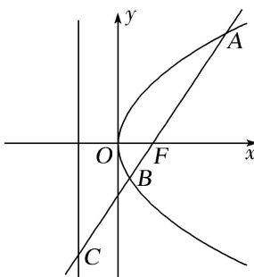

<!-- question-source:start -->
(19)如图，过抛物线 $y^{2} = 2px (p > 0)$ 的焦点 $F$ 的直线交抛物线于点 $A, B$ ，交其准线 $l$ 于点 $C$ ，若 $F$ 是 $AC$ 的中点，且 $|AF| = 4$ ，则线段 $AB$ 的长为（）

A. 5 B. 6 C. $\frac{16}{3}$ D. $\frac{20}{3}$
<!-- question-source:end -->

![[高中/总复习/专题/圆锥曲线/专题08 抛物线模型-圆锥曲线/专题08_抛物线模型/例题/answers/Q00042366A1.md]]
