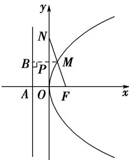

> [!faq]- 《专题08 抛物线模型-圆锥曲线》例题解析
>
> > [!success]- **【答案】** 详见解析
>
> > [!note]- **【解析】**
> > 答案 6 解析 如图，不妨设点 M 位于第一象限内，抛物线 C 的准线交 x 轴于点 A，过点 M 作准线的垂线，垂足为点 B，交 y 轴于点 P，∴ PM // OF.
> >
> > 
> >
> > 由题意知， $F(2,0)$ ， $|FO|=|AO|=2$ ．∵点M为FN的中点， $PM\parallel OF$ ，∴ $|MP|=\frac{1}{2}|FO|=1$ ．又 $|BP|=|AO|=2$ ，∴ $|MB|=|MP|+|BP|=3$ ．由抛物线的定义知 $|MF|=|MB|=3$ ，故 $|FN|=2|MF|=6$ ．
