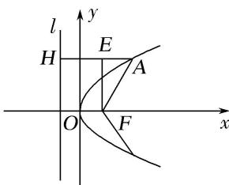

> [!faq]- 教师版例题解析
>
> > [!success]- **【答案】** C
>
> > [!note]- **【分析】**
> > 本题未单列分析。
>
> > [!note]- **【解析】**
> > 答案 C 解析 如图, 作 $AH \perp l$ 于 $H$ , 则 $|AH| = |FA| = 3$ , 作 $FE \perp AH$ 于 $E$ , 则 $|AE| = 3 - \frac{3}{2} = \frac{3}{2}$ , 在 Rt△AEF 中, $\cos \angle EAF = \frac{|AE|}{|AF|} = \frac{1}{2}$ , $\therefore \angle EAF = \frac{\pi}{3}$ , 即直线 $FA$ 的倾斜角为 $\frac{\pi}{3}$ , 同理点 $A$ 在 $x$ 轴下方时, 直线 $FA$ 的倾斜角为 $\frac{2\pi}{3}$ .
> > 
