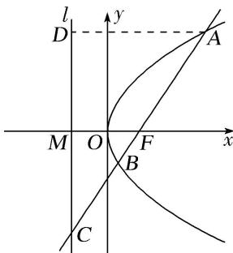
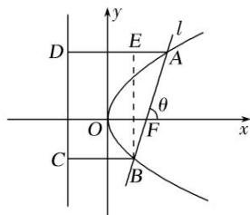

> [!faq]- 教师版例题解析
>
> > [!success]- **【答案】** B
>
> > [!note]- **【分析】**
> > 本题未单列分析。
>
> > [!note]- **【解析】**
> > 答案 C 解析 [一般解法] 如图，设 l 与 x 轴交于点 M，过点 A 作 $AD \perp l$ 交 l 于点 D，由抛物线的定义知， $|AD| = |AF| = 4$ ，由 F 是 AC 的中点，知 $|AD| = 2|MF| = 2p$ ，所以 p = 4，解得 p = 2，所以抛物线的方程为 $y^{2} = 4x$ 。设 $A(x_{1}, y_{1})$ ， $B(x_{2}, y_{2})$ ，则 $|AF| = x_{1} + \frac{p}{2} = x_{1} + 1 = 4$ ，所以 $x_{1} = 3$ ，可得 $y_{1} = 2\sqrt{3}$ ，所以 $A(3, 2\sqrt{3})$ ，又 $F(1, 0)$ ，所以直线 AF 的斜率 $k = \frac{2\sqrt{3}}{3 - 1} = \sqrt{3}$ ，所以直线 AF 的方程为 $y = \sqrt{3}(x - 1)$ ，代入抛物线方程 $y^{2} = 4x$ 得 $3x^{2} - 10x + 3 = 0$ ，所以 $x_{1} + x_{2} = \frac{10}{3}$ ， $|AB| = x_{1} + x_{2} + p = \frac{16}{3}$ 。故选 C.
> > 
> > [应用结论]法一 设 $A(x_{1}, y_{1})$ , $B(x_{2}, y_{2})$ ，则 $|AF|=x_{1}+\frac{p}{2}=x_{1}+1=4$ ，所以 $x_{1}=3$ ，又 $x_{1}x_{2}=\frac{p^{2}}{4}=1$ ，所以 $x_{2}=\frac{1}{3}$ ，所以 $|AB|=x_{1}+x_{2}+p=3+\frac{1}{3}+2=\frac{16}{3}$ .
> > 法二 因为 $\frac{1}{|AF|} +\frac{1}{|BF|} = \frac{2}{p}$ ， $|AF| = 4$ ，所以 $|BF| = \frac{4}{3}$ ，所以 $|AB| = |AF| + |BF| = 4 + \frac{4}{3} = \frac{16}{3}$ (20)过抛物线 $y^{2} = 4x$ 的焦点 $F$ 的直线 $l$ 与抛物线交于 $A, B$ 两点，若 $|AF| = 2|BF|$ ，则 $|AB|$ 等于( )
> > A. 4
> > B. $\frac{9}{2}$ C. 5
> > D. 6
> > 答案 B 解析 [一般解法] 易知直线 l 的斜率存在, 设为 k, 则其方程为 $y = k(x - 1)$ . 由 $\left\{\begin{aligned}y &= k(x - 1), \\ y &= 4x\end{aligned}\right.$ 得 $k^{2}x^{2} - (2k^{2} + 4)x + k^{2} = 0$ , 得 $x_{A} \cdot x_{B} = 1$ , ①. 因为 $|AF| = 2|BF|$ , 由抛物线的定义得 $x_{A} + 1 = 2(x_{B} + 1)$ , 即 $x_{A} = 2x_{B} + 1$ , ②. 由①②解得 $x_{A} = 2$ , $x_{B} = \frac{1}{2}$ , 所以 $|AB| = |AF| + |BF| = x_{A} + x_{B} + p = \frac{9}{2}$ .
> > [应用结论]法一 由对称性不妨设点 A 在 x 轴的上方，如图设 A, B 在准线上的射影分别为 D, C，作 $BE \perp AD$ 于 E，设 $|BF| = m$ ，直线 l 的倾斜角为 $\theta$ ，则 $|AB| = 3m$ ，由抛物线的定义知 $|AD| = |AF| = 2m$ ， $|BC| = |BF| = m$ ，所以 $\cos \theta = \frac{|AE|}{|AB|} = \frac{1}{3}$ ，所以 $\tan \theta = 2\sqrt{2}$ 。则 $\sin^{2}\theta = 8\cos^{2}\theta$ ， $\therefore \sin^{2}\theta = \frac{8}{9}$ 。又 $y^{2} = 4x$ ，知 2p = 4，故利用弦长公式 $|AB| = \frac{2p}{\sin^{2}\theta} = \frac{9}{2}$ 。
> > 
> > 法二 因为 $|AF|=2|BF|$ ， $\frac{1}{|AF|}+\frac{1}{|BF|}=\frac{1}{2|BF|}+\frac{1}{|BF|}=\frac{3}{2|BF|}=\frac{2}{p}=1$ ，解得 $|BF|=\frac{3}{2}$ ， $|AF|=3$ ，故 $|AB|=|AF|+|BF|=\frac{9}{2}$ .
