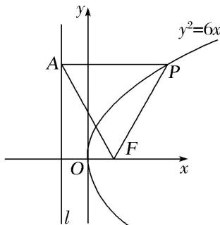

> [!faq]- 《专题08 抛物线模型-圆锥曲线》例题解析
>
> > [!success]- **【答案】** 详见解析
>
> > [!note]- **【解析】**
> > 答案 6 解析 由抛物线方程为 $y^{2} = 6x$ ，所以焦点坐标 $F\left(\frac{3}{2}, 0\right)$ ，准线方程为 $x = -\frac{3}{2}$ ，因为直线 $AF$ 的斜率为 $-\sqrt{3}$ ，所以直线 $AF$ 的方程为 $y = -\sqrt{3}\left(x - \frac{3}{2}\right)$ ，
> >
> > 
> >
> > 当 $x = -\frac{3}{2}$ 时， $y = 3\sqrt{3}$ ，所以 $A\left(-\frac{3}{2}, 3\sqrt{3}\right)$ ，因为 $PA \perp l$ ， $A$ 为垂足，所以点 $P$ 的纵坐标为 $3\sqrt{3}$ ，可得
> >
> > 点 P 的坐标为 $\left(\frac{9}{2}, 3\sqrt{3}\right)$ ，根据抛物线的定义可知 $|PF|=|PA|=\frac{9}{2}-\left(-\frac{3}{2}\right)=6$ .
