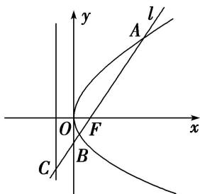

<!-- question-source:start -->
54. 如图，过抛物线 $y^{2}=4x$ 的焦点 F 作倾斜角为 $\alpha$ 的直线 l，l 与抛物线及其准线从上到下依次交于 A、B、C 点，令 $\frac{|AF|}{|BF|}=\lambda_{1}$ ， $\frac{|BC|}{|BF|}=\lambda_{2}$ ，则当 $\alpha=\frac{\pi}{3}$ 时， $\lambda_{1}+\lambda_{2}$ 的值为（）

A. 4 B. 5 C. 6 D. 8
<!-- question-source:end -->

![[高中/总复习/专题/圆锥曲线/专题08 抛物线模型-圆锥曲线/专题08_抛物线模型/对点训练/题目/answers/Q00032246A1.md]]
