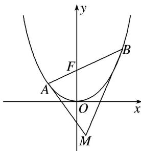

<!-- question-source:start -->
55. 如图所示，抛物线 $y = \frac{1}{4} x^2$ ， $AB$ 为过焦点 $F$ 的弦，过 $A, B$ 分别作抛物线的切线，两切线交于点 $M$ ，设 $A(x_A, y_A), B(x_B, y_B), M(x_M, y_M)$ ，则：①若 $AB$ 的斜率为 1，则 $|AB| = 4$ ；② $|AB|_{\min} = 2$ ；③ $y_M = -1$ ；④若 $AB$ 的斜率为 1，则 $x_M = 1$ ；⑤ $x_A \cdot x_B = -4$ 。以上结论正确的个数是（）

A. 1 B. 2 C. 3 D. 4
<!-- question-source:end -->

![[高中/总复习/专题/圆锥曲线/专题08 抛物线模型-圆锥曲线/专题08_抛物线模型/对点训练/题目/answers/Q00032247A1.md]]
