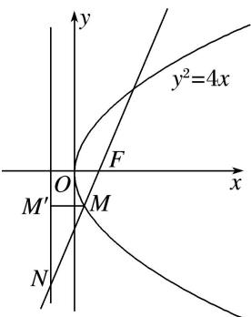

> [!faq]- 教师版对点训练解析
>
> > [!success]- **【答案】** C
>
> > [!note]- **【分析】**
> > 本题未单列分析。
>
> > [!note]- **【解析】**
> > 答案 C 解析 抛物线 $C: y^{2} = 4x$ 的焦点 $F(1, 0)$ , 直线 $l: y = kx - k$ 过抛物线的焦点. 当 $k > 0$ 时, 如图所示,
> > 
> > 过点 M 作 $MM'$ 垂直于准线 x = -1，垂足为 $M'$ ，由抛物线的定义，得 $|MM'| = |MF|$ ，易知 $\angle M'MN$ 与直线 l 的倾斜角相等，由 $2\overrightarrow{FM} = \overrightarrow{MN}$ ，得 $\cos \angle M'MN = \frac{|MM'|}{|MN|} = \frac{1}{2}$ ，则 $\tan \angle M'MN = \sqrt{3}$ ，∴ 直线 l 的斜率 k = $\sqrt{3}$ ；当 k < 0 时，可得直线 l 的斜率 $k = -\sqrt{3}$ 。
> >
> > 故选 **C**.
