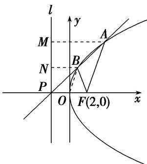

> [!faq]- 教师版对点训练解析
>
> > [!success]- **【答案】** D
>
> > [!note]- **【分析】**
> > 本题未单列分析。
>
> > [!note]- **【解析】**
> > 答案 D 解析 解法 1 设 $A(x_{1}, y_{1}), B(x_{2}, y_{2})$ ，则 $x_{1} > 0, x_{2} > 0, \therefore |FA| = x_{1} + 2, |FB| = x_{2} + 2, \therefore x_{1} + 2 = 2x_{2} + 4, \therefore x_{1} = 2x_{2} + 2.$ 由 $\left\{ \begin{array}{l} y^{2} = 8x \\ y = k(x + 2) \end{array} \right.$ ，得 $k^{2}x^{2} + (4k^{2} - 8)x + 4k^{2} = 0, \therefore x_{1}x_{2} = 4, x_{1} + x_{2} = \frac{8 - 4k^{2}}{k^{2}} = \frac{8}{k^{2}} - 4.$ 由 $\left\{ \begin{array}{l} x_{1} = 2x_{2} + 2 \\ x_{1}x_{2} = 4 \end{array} \right.$ ，得 $x_{2}^{2} + x_{2} - 2 = 0, \therefore x_{2} = 1, \therefore x_{1} = 4, \therefore \frac{8}{k^{2}} - 4 = 5, \therefore k^{2} = \frac{8}{9}, k = \frac{2\sqrt{2}}{3}$ . 解法 2 设抛物线 $C: y^{2} = 8x$ 的准线为 $l$ ，易知 $l: x = -2$ ，直线 $y = k(x + 2)$ 恒过定点 $P(-2, 0)$ ，如图，过 $A, B$ 分别作 $AM \perp l$ 于点 $M, BN \perp l$ 于点 $N$ ，由 $|FA| = 2|FB|$ ，知 $|AM| = 2|BN|$ ，所以点 $B$ 为线段 $AP$ 的中点，连接 $OB$ ，则 $|OB| = \frac{1}{2}|AF|$ ，所以 $|OB| = |BF|$ ，所以点 $B$ 的横坐标为 1，因为 $k > 0$ ，所以点 $B$ 的坐标为 $(1, 2\sqrt{2})$ ，所以 $k = \frac{2\sqrt{2} - 0}{1 - (-2)} = \frac{2\sqrt{2}}{3}$ . 故选 D.
> > 
