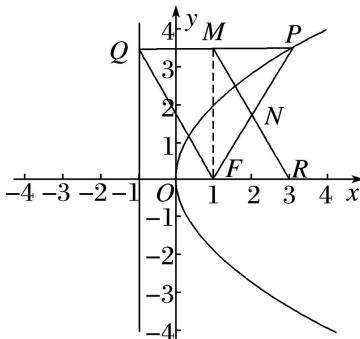

> [!faq]- 教师版对点训练解析
>
> > [!success]- **【答案】** A
>
> > [!note]- **【分析】**
> > 本题未单列分析。
>
> > [!note]- **【解析】**
> > 答案 A 解析 由抛物线 C: $y^{2}=4x$ ，得焦点 $F(1,0)$ ，准线方程为 x=-1，
> > 
> > 因为 M, N 分别为 PQ, PF 的中点，所以 $MN \parallel QF$ ，所以四边形 QMRF 为平行四边形， $|FR| = |QM|$ ，又由 PQ 垂直 l 于点 Q，可知 $|PQ| = |PF|$ ，因为 $\angle NFR = 60^{\circ}$ ，所以 $\triangle PQF$ 为等边三角形，所以 $FM \perp PQ$ ，所以 $|FR| = 2$ ，
> >
> > 故选 **A**.
