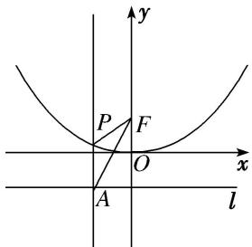

> [!faq]- 《专题08 抛物线模型(教师版)》例题解析
>
> > [!success]- **【答案】** 详见解析
>
> > [!note]- **【解析】**
> > 答案 $\frac{4}{3}$ 解析 法一: 令 $l$ 与 $y$ 轴的交点为 $B$ , 在 Rt $\triangle ABF$ 中, $\angle AFB = 30^{\circ}$ , $|BF| = 2$ , 所以 $|AB| = \frac{2\sqrt{3}}{3}$ . 设 $P(x_0, y_0)$ , 则 $x_0 = \pm \frac{2\sqrt{3}}{3}$ , 代入 $x^2 = 4y$ 中, 得 $y_0 = \frac{1}{3}$ , 所以 $|PF| = |PA| = y_0 + 1 = \frac{4}{3}$ .
> >
> > 
> >
> > 法二：如图所示， $\angle AFO = 30^{\circ}$ ， $\therefore \angle PAF = 30^{\circ}$ ，又 $|PA| = |PF|$ ， $\therefore \triangle APF$ 为顶角 $\angle APF = 120^{\circ}$ 的等腰三角形，而 $|AF| = \frac{2}{\cos 30^{\circ}} = \frac{4\sqrt{3}}{3}$ ， $\therefore |PF| = \frac{|AF|}{\sqrt{3}} = \frac{4}{3}$ .
