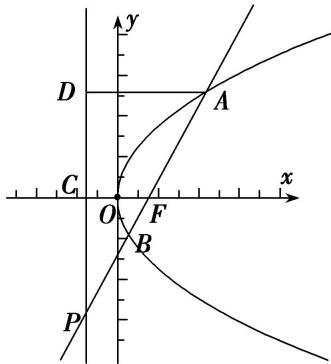

> [!faq]- 《专题08 抛物线模型(教师版)》例题解析
>
> > [!success]- **【答案】** B
>
> > [!note]- **【解析】**
> > 答案 B 解析 如图所示:
> >
> > 
> >
> > 不妨设 A 在第一象限，由抛物线 C: $y^{2}=3x$ 可得 $F\left(\frac{3}{4},0\right)$ ，准线 DP: $x=-\frac{3}{4}$ 。因为 $\overrightarrow{AF}=\overrightarrow{FP}$ ，所以 F 是 AP 的中点，则 AD=2CF=3。所以可得 $A\left(\frac{9}{4},\frac{3\sqrt{3}}{2}\right)$ ，则 $k_{AF}=\sqrt{3}$ ，所以直线 AP 的方程为： $y=\sqrt{3}\left(x-\frac{3}{4}\right)$ ，联立方程 $\left\{\begin{aligned}y&=\sqrt{3}\left(x-\frac{3}{4}\right)\\ y^2&=3x\end{aligned}\right.$ ，整理得： $x^{2}-\frac{5}{2}x+\frac{9}{16}=0$ ，所以 $x_{1}+x_{2}=\frac{5}{2}$ ，则 $|AB|=x_{1}+x_{2}+p=\frac{5}{2}+\frac{3}{2}=4$ 。
> >
> > 故选 **B**.
