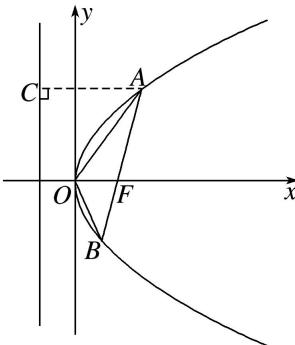

> [!faq]- 《专题08 抛物线模型(教师版)》例题解析
>
> > [!success]- **【答案】** A
>
> > [!note]- **【解析】**
> > 答案 C 解析 设 $A(x_{1}, y_{1})$ , $B(x_{2}, y_{2})(y_{1}>0, y_{2}<0)$ ，如图所示， $|AF|=x_{1}+1=3$ ,
> >
> > 
> >
> > 所以 $x_{1}=2,\ y_{1}=2\sqrt{2}$ . 设 AB 的方程为 x-1=ty，由 $\left\{\begin{aligned}y^{2}&=4x,\\ x&-1=ty,\end{aligned}\right.$ 消去 x，得 $y^{2}-4ty-4=0$ . 所以 $y_{1}y_{2}=-4$ . 所以 $y_{2}=-\sqrt{2},\ x_{2}=\frac{1}{2}$ ，所以 $S_{\triangle AOB}=\frac{1}{2}\times1\times|y_{1}-y_{2}|=\frac{3\sqrt{2}}{2}$ .
