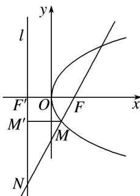

> [!faq]- 《专题08 抛物线模型(教师版)》例题解析
>
> > [!success]- **【答案】** D
>
> > [!note]- **【解析】**
> > 答案 D 解析 如图，过 M 向准线 l 作垂线，垂足为 $M'$ ，根据已知条件，结合抛物线的定义得 $\frac{|MM'|}{|FF'|} = \frac{|MN|}{|NF|} = \frac{\lambda - 1}{\lambda}$ ,
> >
> > 
> >
> > 又 $|MF|=4,\therefore|MM'|=4$ ，又 $|FF'|=6,\therefore\frac{|MM'|}{|FF'|}=\frac{4}{6}=\frac{\lambda-1}{\lambda},\therefore\lambda=3$ ．
> >
> > 故选 **D**.
