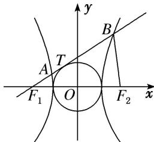

<!-- question-source:start -->
(24)如图，已知 $F_{1}$ ， $F_{2}$ 分别是双曲线 $x^{2} - \frac{y^{2}}{b^{2}} = 1 (b > 0)$ 的左、右焦点，过点 $F_{1}$ 的直线与圆 $x^{2} + y^{2} = 1$ 相切于点 $T$ ，与双曲线的左、右两支分别交于 $A$ ， $B$ ，若 $|F_{2}B| = |AB|$ ，则 $b$ 的值是 \_\_\_\_.

<!-- question-source:end -->

![[高中/总复习/专题/圆锥曲线/专题09 含两种曲线模型-圆锥曲线/专题09_含两种曲线模型/例题/answers/Q00042374A1.md]]
