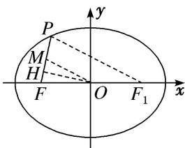

> [!faq]- 教师版例题解析
>
> > [!success]- **【答案】** 详见解析
>
> > [!note]- **【分析】**
> > 本题未单列分析。
>
> > [!note]- **【解析】**
> > 答案 $\sqrt{15}$ 解析 法一：依题意，设点 $P(m, n)(n > 0)$ ，由题意知 $F(-2, 0)$ ，所以线段 $FP$ 的中点 $M\left[\frac{-2 + m}{2}, \frac{n}{2}\right]$ 在圆 $x^{2} + y^{2} = 4$ 上，所以 $\left[\frac{-2 + m}{2}\right]^{2} + \left[\frac{n}{2}\right]^{2} = 4$ ，①．又点 $P(m, n)$ 在椭圆 $\frac{x^2}{9} + \frac{y^2}{5} = 1$ 上，所以 $\frac{m^2}{9} + \frac{n^2}{5} = 1$ ，②．联立①②，消去 $n$ ，得 $4m^2 - 36m - 63 = 0$ ，所以 $m = -\frac{3}{2}$ 或 $m = \frac{21}{2}$ （舍去）， $n = \frac{\sqrt{15}}{2}$ ，所以 $k_{PF} = \frac{\frac{\sqrt{15}}{2} - 0}{-\frac{3}{2} - (-2)} = \sqrt{15}$ .
> > 
> > 法二：如图，取 PF 的中点 M，连接 OM，由题意知 $|OM|=|OF|=2$ ，设椭圆的右焦点为 $F_{1}$ ，连接 $PF_{1}$ ，在 $\triangle PFF_{1}$ 中，OM 为中位线，所以 $|PF_{1}|=4$ ，由椭圆的定义知 $|PF|+|PF_{1}|=6$ ，所以 $|PF|=2$ 。因为 M 为 PF 的中点，所以 $|MF|=1$ 。在等腰三角形 OMF 中，过 O 作 $OH\perp MF$ 于点 H，所以 $|OH|=\sqrt{2^{2}-\left(\frac{1}{2}\right)^{2}}=\frac{\sqrt{15}}{2}$ ，
> > 所以 $k_{PF}=\tan\angle HFO=\frac{\frac{2}{1}}{2}=\sqrt{15}.$
