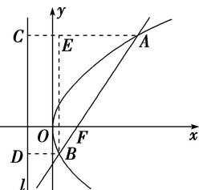

> [!faq]- 教师版例题解析
>
> > [!success]- **【答案】** A
>
> > [!note]- **【分析】**
> > 本题未单列分析。
>
> > [!note]- **【解析】**
> > 答案 A 解析 如图，作出抛物线的准线 $l: x = -\sqrt{3}$ ，设 $A$ 、 $B$ 在 $l$ 上的射影分别是 $C$ 、 $D$ ，
> > 
> > 连接 $AC$ 、 $BD$ ，过 $B$ 作 $BE \perp AC$ 于 $E$ 。\$\because \overrightarrow{AF} = 3\overrightarrow{FB}\$，\$\therefore\$ 设 $|AF| = 3m$ ， $|BF| = m$ ，\$\because\$ 点 $A$ 、 $B$ 在抛物线上，\$\therefore |AC| = 3m\$, $|BD| = m$ 。因此，在 Rt\$\triangle ABE\$ 中， $|AB| = 4m$ ， $|AE| = 2m$ ，\$\therefore \cos \angle BAE = \frac{1}{2}\$，\$\therefore \angle BAE = 60^\circ\$, \$\therefore\$ 直线 $AB$ 的倾斜角为 $60^\circ$ ，即直线 $AB$ 的斜率 \$k = \tan 60^\circ = \sqrt{3}\$，\$\therefore\$ 直线 $AB$ 的方程为 \$y = \sqrt{3}(x - \sqrt{3})\$，代入抛物线方程得 \$3x^2 - 10\sqrt{3}x + 9 = 0\$。 $\therefore x_A + x_B = \frac{10\sqrt{3}}{3}$ ， $x_A \cdot x_B = 3$ 。 $\therefore y_A + y_B = \sqrt{3}(x_A - \sqrt{3}) + \sqrt{3}(x_B - \sqrt{3}) = 4$ ， $|AB| = x_A + x_B + p = \frac{16}{\sqrt{3}}$ ，\$\therefore AB\$ 中点的坐标为 \$\left(\frac{x\_A + x\_B}{2}, \frac{y\_A + y\_B}{2}\right)\$，即 \$\left(\frac{5\sqrt{3}}{3}, 2\right)\$。则以 $AB$ 为直径的圆的标准方程为 \$\left(x - \frac{5\sqrt{3}}{3}\right)^2 + (y - 2)^2 = \frac{64}{3}\$。
> >
> > 故选 **A**。
