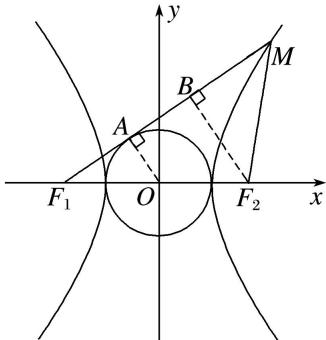

> [!faq]- 《专题09 含两种曲线模型-圆锥曲线》例题解析
>
> > [!success]- **【答案】** A
>
> > [!note]- **【解析】**
> > 答案 A 解析 如图，作 $OA \perp F_{1}M$ 于点 A， $F_{2}B \perp F_{1}M$ 于点 B.
> >
> > 
> >
> > 因为 $F_{1}M$ 与圆 $x^{2}+y^{2}=a^{2}$ 相切， $\angle F_{1}MF_{2}=45^{\circ}$ ，所以 $|OA|=a,\quad|F_{2}B|=|BM|=2a,\quad|F_{2}M|=2\sqrt{2}a,\quad|F_{1}B|=2b$ 。又点 M 在双曲线上，所以 $|F_{1}M|-|F_{2}M|=2a+2b-2\sqrt{2}a=2a$ 。整理，得 $b=\sqrt{2}a$ 。所以 $\frac{b}{a}=\sqrt{2}$ 。所以双曲线的渐近线方程为 $y=\pm\sqrt{2}x$ 。
> >
> > 故选 **A**。
